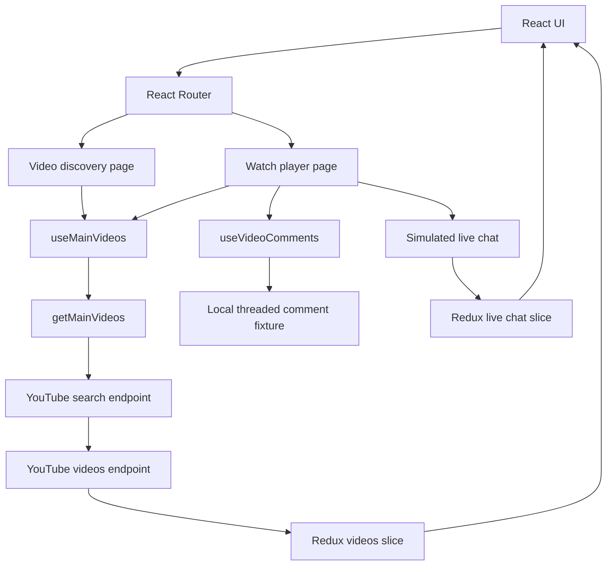

# DevTube

DevTube is a responsive programming-video discovery and watch experience built with React. It combines the familiar structure of a video platform with a clean learning-focused interface: topic navigation, a detailed watch page, a simulated live chat, recommendations, and threaded comments.

## Highlights

- Browse programming videos across Home, Trending, Web Development, DSA, Backend, AI/ML, DevOps, System Design, and Interview Prep.
- Search YouTube Data API results, then enrich every result with duration and engagement statistics.
- Watch videos in an embedded YouTube player with views, likes, duration, publication date, and recommendations.
- Use a responsive watch layout with independent Live Chat and Up Next scroll areas.
- Send live-chat messages with smooth scroll-to-latest behavior and a capped message history.
- Navigate nested, recursive comment threads.
- Preserve the client-side route on Vercel using an SPA rewrite.

## Tech stack

- React 19 + Vite
- Tailwind CSS 4
- Redux Toolkit + React Redux
- React Router
- YouTube Data API v3
- Lucide React icons
- Vercel-ready SPA configuration

## Architecture



## How data flows

### Video discovery and API batching

`getMainVideos` makes two YouTube Data API requests:

1. It calls `search.list` to find up to 20 long-form videos for the selected topic.
2. It collects the returned video IDs and makes one `videos.list` request for statistics and content details.
3. It merges the search metadata with each detailed video response before storing the result in Redux.

This avoids one extra detail request per card. It is API batching, not connection pooling.

### Client-side caching

`useMainVideos` checks `videos.mainVideos[title]` before requesting data. Once a category has loaded, Redux keeps the result in memory for the current browser session, so revisiting that category does not fetch it again.

### Watch page

Selecting a video stores its data in `videoSlice` and navigates to `/watch`. The watch page uses the selected data immediately, with a lookup fallback from the cached category list after a refresh. Recommended videos are the cached category results excluding the current video.

### Live chat

The project currently demonstrates live-chat UI behavior locally. An interval adds realistic sample messages, Redux caps the history at 50 entries, and a submitted message uses the project avatar and scrolls the chat panel to the newest entry.

### Comments

The main comment tree is currently a local asynchronous fixture. `VideoComment` renders replies recursively, which keeps nested comment rendering reusable at any depth.

## Important implementation notes

The project uses the YouTube Data API v3 for video discovery and metadata, plus a YouTube embed iframe for playback. It does **not** currently use the YouTube Live Chat API, server-side API polling, or debounced search input. Those are sensible next enhancements, but they are not represented as shipped features in this README.

## Getting started

### Prerequisites

- Node.js 18+
- A YouTube Data API v3 key

### Install and run

```bash
npm install
```

Create a `.env.local` file in the project root:

```env
VITE_YOUTUBE_API_KEY=your_youtube_data_api_key
```

Then start the development server:

```bash
npm run dev
```

## Available scripts

```bash
npm run dev     # Start Vite development server
npm run build   # Create a production build
npm run lint    # Run ESLint
npm run preview # Preview the production build
```

## Project structure

```text
src/
├── api/          # YouTube and comment data functions
├── assets/       # DevTube logo and live-chat avatar
├── Components/
│   ├── Layout/   # Header, sidebar, reusable video card
│   ├── Main/     # Discovery page and video grid
│   └── Watch/    # Player, comments, recommendations, live chat
├── hooks/        # Data-fetching and Redux dispatch hooks
└── utils/        # Redux store, slices, constants, formatters
```

## Deployment

`vercel.json` rewrites every route to `index.html`, allowing React Router routes such as `/watch` to work after a direct page refresh on Vercel.

## Roadmap

- Connect the search input with debouncing and URL-based queries.
- Replace demo comments with the YouTube comment threads endpoint.
- Add YouTube Live Chat API support for live streams.
- Add loading, empty, and API-error states.
- Persist user messages with an authenticated backend.

---

Built as a portfolio project focused on practical React state management, API composition, and responsive interface design.
